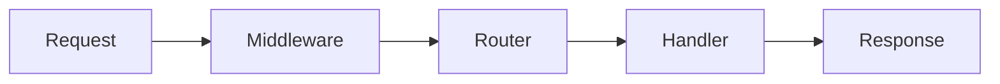

# notes-gen — Spec

## 1. Objective

CLI tool that converts YouTube videos/playlists and web pages into complete, beautifully formatted Obsidian-style markdown notes. Target user: developer who learns from YouTube and web content and wants structured, permanent notes without manual effort.

Core promise: **complete coverage of conceptual content**, filtered of meta-commentary, formatted for Obsidian, fast.

---

## 2. Commands

```
notes-gen <source>                    # auto-detect source type
notes-gen video <url>                 # single YouTube video
notes-gen playlist <url>             # YouTube playlist
notes-gen web <url>                  # website / article
notes-gen text <file|->              # raw transcript file or stdin

notes-gen config init                # create default config
notes-gen config show                # print resolved config
```

### Global flags (override config file)
```
--output-dir, -o <path>      override output directory
--model, -m <model_id>       LiteLLM model string (e.g. openai/gpt-4o, anthropic/claude-sonnet-4-6)
--no-mermaid                 disable mermaid diagram generation
--verbose, -v                show progress details
```

---

## 3. Input Handling

### YouTube video
- Fetch transcript via `youtube-transcript-api` (auto-generated or manual captions)
- Fallback: `yt-dlp --write-auto-sub` if transcript API fails
- Extract video metadata: title, channel, URL, duration
- If no captions exist (manual or auto-generated): fail loudly with clear error message showing video title/URL, skip remaining playlist videos unless `--force` flag used

### YouTube playlist
- Use `yt-dlp` to enumerate all videos in playlist
- Fetch transcripts per video (parallel, max 5 concurrent)
- Extract playlist metadata: name, video count

### Website / URL
- Fetch with `httpx` (respect redirects, user-agent)
- Extract main content via `trafilatura` (strips nav, ads, boilerplate)
- Fallback: `beautifulsoup4` + manual noise removal
- Follow internal links: crawl same-domain links found in main content (e.g. doc pages linking to sub-pages)
- Max crawl depth: 3 levels; max pages: 50 (configurable via `web_max_pages` in config)
- Deduplicate URLs before fetching; skip external domains

### Raw text / transcript
- Accept from file path or stdin (`-`)
- Minimal preprocessing: normalize whitespace

---

## 4. LLM Processing

### Provider
- **LiteLLM** for all LLM calls — fully provider-agnostic
- Model configured in config file or `--model` flag
- API keys read from environment variables (LiteLLM convention)

### Filtering pass (if needed for long content)
- Strip meta-commentary: sponsor mentions, channel subscribe calls, "in this video I'll...", social media plugs
- Retain: tips, warnings, code examples, conceptual explanations, numbered steps, comparisons

### Notes generation prompt strategy
- System prompt instructs: "You are a technical notes writer. Generate complete, structured Obsidian markdown notes. Cover ALL concepts. Omit self-promotion and filler. Use callouts for tips/warnings. Add mermaid diagrams for flows/architectures. Format beautifully."
- For long transcripts: chunk into logical segments, generate notes per chunk, merge with deduplication pass
- Temperature: 0.3 (consistent, factual)

### Chunking strategy
- Max ~12k tokens per chunk
- Split at natural boundaries (topic shifts, timestamps if available)
- Overlap: 200 tokens between chunks for context continuity

---

## 5. Output Structure

### Single video / single webpage
```
<output_dir>/
  <slugified-title>.md
```

### Playlist
```
<output_dir>/
  <playlist-name>/
    index.md              # overview + [[wikilinks]] to all notes
    <video-1-title>.md
    <video-2-title>.md
    ...
```

If playlist covers multiple distinct topics (detected from content), group:
```
<playlist-name>/
  index.md
  01-topic-a/
    index.md              # topic overview + links
    video-1.md
    video-2.md
  02-topic-b/
    ...
```
Topic grouping only if ≥3 videos clearly share a distinct theme.

---

## 6. Note Format (Obsidian Style)

```markdown
---
title: "FastAPI Fundamentals"
source: "https://youtube.com/watch?v=..."
type: video | playlist-part | article
tags: [fastapi, python, web, api]   # auto-inferred from content by LLM
date: 2026-05-23
---

# FastAPI Fundamentals

## Overview
Brief 2-3 sentence summary.

## Key Concepts

### Dependency Injection
Explanation...

> [!TIP]
> Use `Depends()` for shared logic across routes.

> [!WARNING]
> Don't use mutable default arguments in Pydantic models.

### Request Lifecycle



## Practical Notes

### Setup
```bash
pip install fastapi uvicorn
```

### Core Pattern
```python
from fastapi import FastAPI
app = FastAPI()

@app.get("/items/{item_id}")
def read_item(item_id: int):
    return {"id": item_id}
```

## Summary
- Key takeaway 1
- Key takeaway 2

## See Also
- [[Related-Note]]
```

Rules:
- Max 2 levels of nesting for sections (## and ###)
- Code blocks for all code samples
- Callouts only for genuine tips/warnings (not decorative)
- Mermaid only when a diagram genuinely clarifies a flow or architecture
- No excessive scrolling: aim for dense, information-rich notes, not padding

---

## 7. Configuration

### File location
`~/.config/notes-gen/config.yaml`

### Schema
```yaml
output_dir: ~/notes          # default output directory
model: anthropic/claude-sonnet-4-6  # LiteLLM model string
mermaid: true
max_concurrent: 5            # parallel video fetches for playlists
web_max_pages: 50            # max pages to crawl per website input
web_max_depth: 3             # crawl depth limit
```

### API keys
Set via environment variables per LiteLLM convention:
- `ANTHROPIC_API_KEY`
- `OPENAI_API_KEY`
- `GEMINI_API_KEY`
- etc.

---

## 8. Project Structure

```
notes_generator/
  notes_gen/
    __init__.py
    cli.py              # Typer app, command definitions
    config.py           # config file load/merge with CLI flags
    sources/
      __init__.py
      youtube.py        # video + playlist transcript fetching
      web.py            # URL scraping
      text.py           # raw text input
    processing/
      __init__.py
      filter.py         # meta-commentary removal
      chunker.py        # token-aware chunking
      llm.py            # LiteLLM wrapper, prompt templates
      merger.py         # merge chunked notes, dedup
    output/
      __init__.py
      formatter.py      # slug generation, frontmatter, file naming
      writer.py         # write files, create dirs, wikilink index
  tests/
    test_youtube.py
    test_web.py
    test_chunker.py
    test_formatter.py
    fixtures/
      sample_transcript.txt
      sample_html.html
  pyproject.toml
  README.md
  SPEC.md
```

---

## 9. Tech Stack

| Purpose | Library |
|---|---|
| CLI framework | `typer` |
| HTTP client | `httpx` |
| Web content extraction | `trafilatura` |
| YouTube transcripts | `youtube-transcript-api` |
| YouTube metadata/playlist | `yt-dlp` |
| LLM routing | `litellm` |
| Token counting | `tiktoken` |
| Rich terminal output | `rich` |
| Config parsing | `pyyaml` |
| HTML fallback parsing | `beautifulsoup4` |
| Async concurrency | `asyncio` + `anyio` |

Python ≥ 3.11. Distributed as a pip-installable package with `notes-gen` entry point.

---

## 10. Code Style

- Type hints everywhere (functions, variables)
- No comments unless WHY is non-obvious
- Dataclasses or Pydantic models for structured data
- No global state; pass config explicitly
- Functions ≤ 40 lines; extract if longer
- `ruff` for linting + formatting (line length 100)

---

## 11. Testing Strategy

- Unit tests: chunker, formatter, filter logic (no LLM, no network)
- Integration tests: mocked HTTP responses for web scraper, mocked `youtube-transcript-api`
- LLM calls: mocked in tests using `unittest.mock`
- No end-to-end tests hitting real APIs in CI
- Coverage target: 80% on `processing/` and `output/` modules

---

## 12. Boundaries

### Always do
- Generate complete notes — no skipping content
- Strip meta-commentary (subscriptions, sponsorships, channel plugs)
- Respect output directory from config/flag
- Show progress in terminal (rich progress bar for playlists)

### Ask first
- Overwriting existing note files (prompt: overwrite / skip / rename)
- Grouping playlist into topic subfolders (only auto-group if confident)

### Never do
- Store API keys in config file (env vars only)
- Truncate notes to fit a size limit — completeness over brevity
- Make network calls during tests
- Hard-code any LLM provider or model name in logic layer
